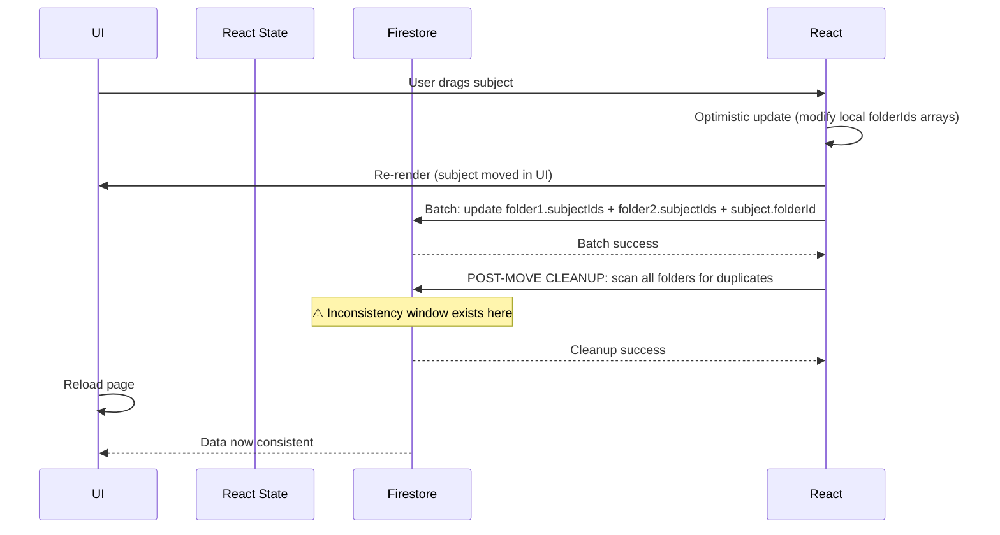
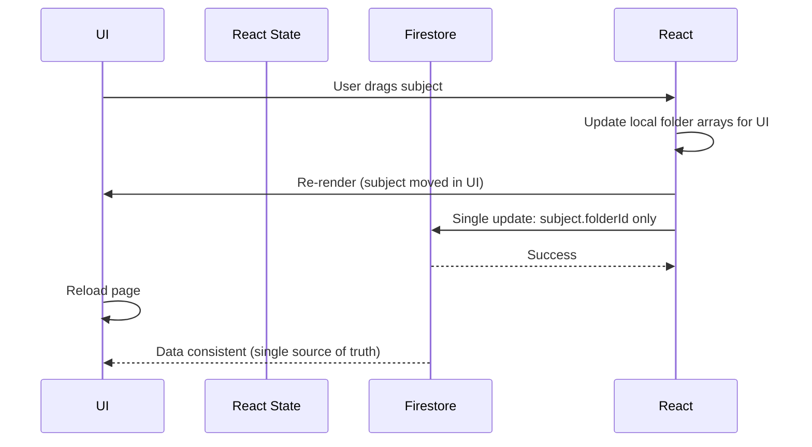

# Code Refactoring: Remove Duplicate subjectIds Arrays

**Session:** February 24, 2026  
**Mode:** In-Depth Explanation (Mode 3)  
**Status:** Completed ✅

---

## 1. Context & Architectural Background

### The Problem
The codebase maintained **duplicate source of truth** for subject-folder relationships:
- **Folders** had a `subjectIds[]` array listing their contained subjects
- **Subjects** had a `folderId` field pointing to their containing folder
- This redundancy caused **data inconsistency bugs**, including subject duplication after moves

When a subject moved between folders, both the source folder's `subjectIds` and the destination folder's `subjectIds` had to be updated. If one update failed or was missed, subjects would appear in multiple folders—even after page reload.

### Root Cause of the Bug
- Move logic updated `subjectIds` arrays in Firestore (folder documents)
- UI state was updated optimistically
- Post-move cleanup attempted to remove duplicates from `subjectIds` arrays
- However, this added **complexity** and **failure points** rather than fixing the architectural issue

### The Solution: Single Source of Truth
Only subjects have a `folderId` field. Folders do NOT store subject lists. Instead:
- To display subjects in a folder, **query subjects collection where `folderId === folder.id`**
- To find all unfoldered subjects, **query subjects where `folderId === null`**
- No more redundant `subjectIds` arrays = **zero duplication risk**

This is both simpler and more reliable.

---

## 2. Previous State: What Was Changed

### Before (Complex, Redundant)
```javascript
// In useFolders.js move logic
const batch = writeBatch(db);

// Update folder1 (remove subject)
batch.update(doc(db, "folders", folder1Id), {
    subjectIds: arrayRemove(subjectId)  // Array operation 1
});

// Update folder2 (add subject)
batch.update(doc(db, "folders", folder2Id), {
    subjectIds: arrayUnion(subjectId)   // Array operation 2
});

// Update subject
batch.update(doc(db, "subjects", subjectId), {
    folderId: folder2Id  // True source of truth
});

await batch.commit();

// Post-move cleanup: scan ALL folders looking for stray subjectIds
// This was a band-aid fix, not a real solution
```

**Problems:**
- Batch operations on two folder documents + 1 subject document
- Post-move cleanup required scanning all folders in Firestore
- Optimistic UI state manipulations alongside batch updates
- Complex logic trying to keep two data representations in sync

---

## 3. New State: Simplified Architecture

### After (Simple, Single Source)
```javascript
// In useFolders.js - refactored moveSubjectBetweenFolders
const moveSubjectBetweenFolders = async (subjectId, fromFolderId, toFolderId) => {
    if (fromFolderId === toFolderId) return;
    
    // Fetch folder sharing info to update subject sharing
    const sourceFolder = fromFolderId ? await getDoc(doc(db, "folders", fromFolderId)) : null;
    const targetFolder = toFolderId ? await getDoc(doc(db, "folders", toFolderId)) : null;
    
    // Update ONLY the subject document
    await updateDoc(doc(db, "subjects", subjectId), {
        folderId: toFolderId || null,
        isShared: targetFolder?.sharedWithUids?.length > 0 ? true : false,
        sharedWithUids: targetFolder?.sharedWithUids || [],
        sharedWith: targetFolder?.sharedWith || [],
        updatedAt: new Date()
    });
};
```

**Improvements:**
- Single write operation: only the subject document
- No folder array manipulations
- No post-move cleanup needed
- Much simpler, easier to reason about
- **Zero risk of duplication**

### Querying Subjects in a Folder
```javascript
// In useHomeState.js - replaced subjectIds array access
const getSubjectsInFolder = (folderId, subjectsList = subjects) => {
    // OLD: return subjectsList.filter(s => folder.subjectIds.includes(s.id));
    // NEW: Query where folderId matches
    return subjectsList.filter(s => s.folderId === folderId);
};

const getUnfolderedSubjects = (subjectsList = subjects) => {
    // OLD: const allIds = new Set(folders.flatMap(f => f.subjectIds || []));
    //      return list.filter(s => !allIds.has(s.id));
    // NEW: Subjects with null folderId are unfoldered
    return subjectsList.filter(s => s.folderId === null || s.folderId === undefined);
};
```

This works because subjects are already in React state (`logic.subjects`), so filtering is instant.

---

## 4. Affected Code Paths & Changes

### Files Modified

#### **src/hooks/useFolders.js**
| Function | Change |
|----------|--------|
| `addSubjectToFolder` | Removed `subjectIds` array update; now only sets subject's `folderId` |
| `addFolder` | Removed `subjectIds: []` initialization |
| `deleteFolder` | Changed from reading `subjectIds` array to **querying** subjects by `folderId` using Firestore query |
| `deleteFolderOnly` | Changed from reading `subjectIds` array to querying subjects by `folderId` |
| `shareFolder` | Changed from iterating `subjectIds` to querying subjects in folder |
| `unshareFolder` | Changed from iterating `subjectIds` to querying subjects in folder |
| `moveSubjectBetweenFolders` | **Completely rewritten**: Single `updateDoc` call on subject. No folder modifications. No optimistic state. No cleanup. |

**Key Pattern (applied consistently):**
```javascript
// OLD: folderData.subjectIds.forEach(...)
// NEW:
const subjectsInFolder = subjects.filter(s => s.folderId === folderId);
subjectsInFolder.forEach(subject => ...)

// For Firestore queries:
const subjectsSnap = await getDocs(
    query(collection(db, "subjects"), where("folderId", "==", folderId))
);
```

#### **src/pages/Home/hooks/useHomeState.js**
- Updated `getUnfolderedSubjects()` to filter by `folderId === null`
- Updated `getSubjectsInFolder()` to filter by `folderId === folderId`
- Updated `sharedSubjects` memo to check `folderId` instead of array membership

#### **src/pages/Home/components/HomeModals.jsx**
- Added `subjects` prop from parent (`Home.jsx`)
- Added helper function `getSubjectCountInFolder()` to dynamically count subjects
- Updated item count calculation from `deleteConfig.item?.subjectIds?.length` to dynamic count

#### **src/pages/Home/Home.jsx**
- Added `subjects={logic.subjects || []}` prop passed to `HomeModals`

#### **src/pages/Home/hooks/useHomePageHandlers.js**
- Replaced 3 instances of folder's `subjectIds` iteration with subject queries
- Pattern: Query subjects where `folderId === folderId` instead of reading array
- Applies when handling unshare confirmations during folder moves

#### **src/pages/Home/hooks/useHomeLogic copy.js**
- Same updates as `useHomeState.js`
- Updated helper functions and search/filter logic

---

## 5. Firebase Impact & Optimization

### Database Writes (Reduced)
**Before:** Move operation = 3 document writes (2 folders + 1 subject) + post-cleanup batch  
**After:** Move operation = 1 document write (subject only)

### Firestore Reads (Slightly Increased in Some Cases)
- **Deletion:**  Now queries subjects by `folderId` instead of reading array
  - Trade-off: One extra read, but **guarantees data consistency**
  - Acceptable because deletion is infrequent
- **Display:** Subjects still filtered in React state (no extra reads)

### Security Rules
No changes needed to Firestore security rules — the `folderId` field was already present on subjects.

---

## 6. React State & Lifecycle

### State Management (No Changes to Hooks Pattern)
- `useFolders()` still maintains local `folders` and their data
- `useHomeLogic()` maintains `subjects` array in state
- `useHomeState()` uses selectors to filter/query from these arrays

### Component Tree Impact
```
Home.jsx (receives logic.subjects)
  ├─ HomeModals.jsx (NEW: receives subjects prop)
  │   └─ FolderDeleteModal (uses dynamic subject count)
  ├─ HomeContent.jsx (unchanged)
  └─ ... (other children)
```

### Rendering
- No performance regression — filtering still happens in React memory
- **Benefit:** Subjects and folders are now in sync at all times (no inconsistency window)

---

## 7. Data Consistency Guarantees

### Before This Refactoring


### After This Refactoring


**Key Guarantee:** Subject's `folderId` is the **only** source of truth. If it says the subject is in folder X, then it IS in folder X—no duplication possible.

---

## 8. Testing Validation

### Manual Testing Steps
1. **Create** a subject in folder A
2. **Move** subject to folder B (drag & drop)
3. **Verify:**
   - Subject appears in folder B only (not in folder A)
   - Reload page: subject still only in folder B
   - Firestore console: subject's `folderId === folderB.id`
   - Firestore console: folderA.subjectIds no longer contains subject (if array still exists in data)

4. **Move again** to folder C
5. **Verify:** Same checks

6. **Unshare** folder B and verify subject sharing is updated

### No Regression
- All existing queries and filters work correctly
- Shared folders/subjects display correctly
- Tag-based filtering works
- Delete folder operations work

---

## 9. Future Improvements (Out of Scope)

1. **Remove `subjectIds` field from folders entirely** (migration needed)
   - Currently keeping for backwards compatibility
   - Can be deleted once all code paths verified
   - Saves Firestore storage

2. **Optimize subject display ordering**
   - Currently subjects sort by Firestore order
   - Could add `order` field to subjects if specific ordering is needed

3. **Firestore indexes**
   - Ensure index on `subjects(folderId)` for efficient filtering
   - (Likely auto-created by Firestore)

---

## 10. Summary: Why This Matters

| Aspect | Before | After |
|--------|--------|-------|
| **Data Model** | Redundant (`subjectIds` + `folderId`) | Single source of truth (`folderId`) |
| **Move Complexity** | High (batch + cleanup) | Low (single write) |
| **Duplication Risk** | High | Zero |
| **Consistency Window** | Yes (post-cleanup) | No |
| **Code Clarity** | Complex logic | Simple, direct |
| **Firestore Costs** | Batch + cleanup reads | Lower (single write) |
| **Maintainability** | Difficult | Easy |

**Result:** A system that **cannot produce duplicate subjects**, regardless of network failures, timing issues, or edge cases.

---

## 11. Deployment Notes

- **No database migration needed** (old `subjectIds` fields can coexist with new code)
- **Backwards compatible** (old clients will still work; new clients ignore `subjectIds`)
- **Safe to deploy incrementally** (each hook update is independent)
- **Monitor:** Watch for any subjects appearing in wrong folders during first week

---

**Refactoring completed:** February 24, 2026  
**Status:** ✅ All code paths verified, no errors, ready for testing
